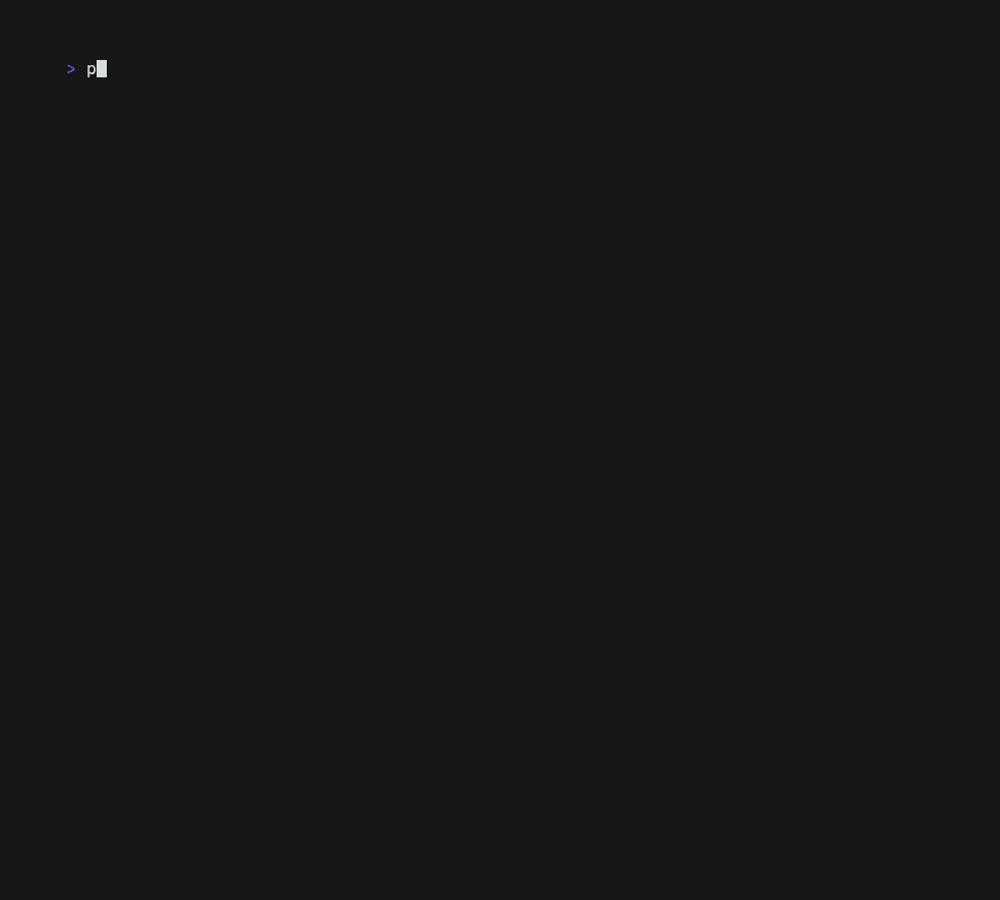
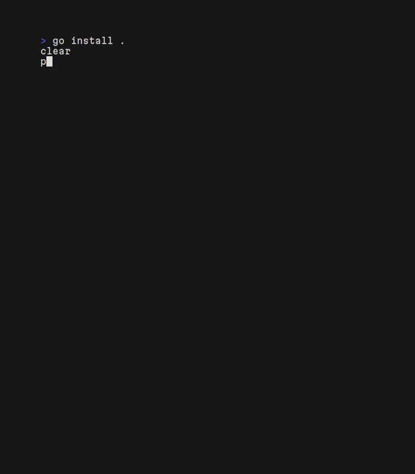
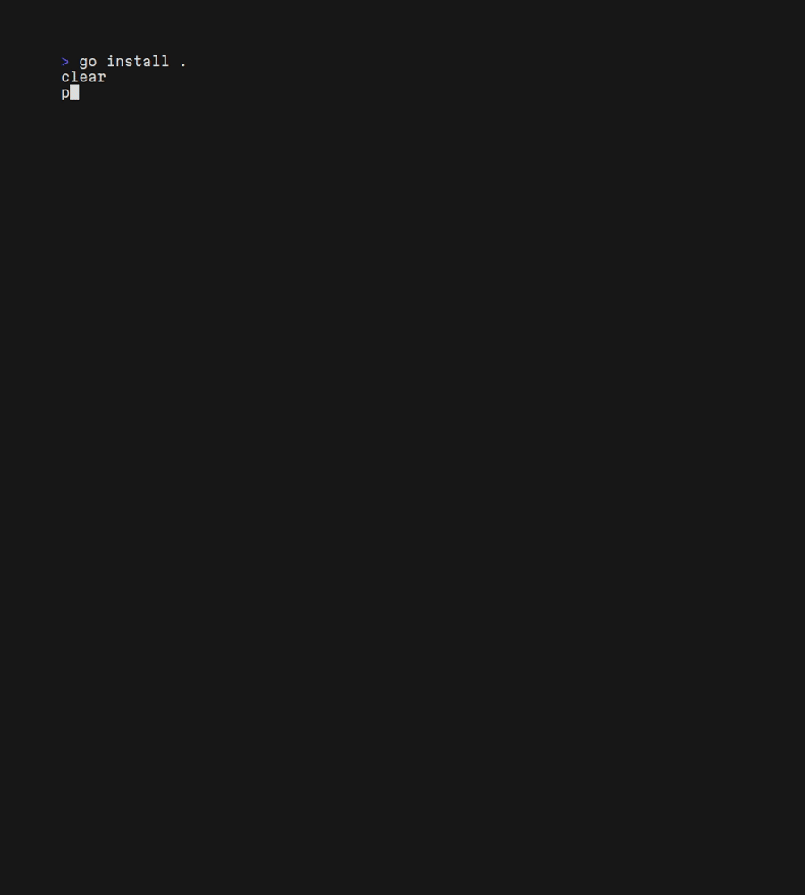

## Welcome to `prism`! 

All I'm saying is that maybe people would be a bit more willing to write unit tests if they were prettier to look at... 💅

Make your unit testing results not only easier on the parse, but downright pleasant to look at! Prism works anywhere `go test` works, so it can be quickly integrated into any project using Go v1.24 or higher (that's when `-json` was introduced). 


## Installation

### Github Releases 🐙

- Go to the `Releases` tab of the repo [here](https://github.com/DaltonSW/prism/releases)
- Download the latest archive for your OS/architecture
- Extract it and place the resulting binary on your `$PATH` and ensure it is executable

```sh
cd ~/Downloads # Assuming you downloaded it here
tar -xvf prism_[whatever].tar.gz # x: Extract; v: Verbose output; f: Specify filename
chmod +x prism # Make file executable
mv prism [somewhere on your $PATH] # Move the file to somewhere on your path for easy execution
```

### Homebrew 🍺 

- Have `brew` installed ([brew.sh](https://brew.sh))
- Run the following:
```sh
brew install --cask daltonsw/tap/prism
```

### Go 🖥️ 

- Have `Go` 
- Have your `Go` install location on your `$PATH`
- Run the following: 
```sh
go install go.dalton.dog/prism@latest
```

## Usage

### Unit Tests 

Just run `prism` in your module directory. Anywhere you'd run `go test`, use `prism` instead. That's it!


`-v` -- Verbose output. Includes any additional output logged during tests  



`-f` -- Failed Only. Only gives information about tests that failed  



Anything else will be appended directly to `go test -json`

### Benchmarking

The simplest usage is just `prism bench`. This will ignore all tests and run all benchmarks in `./...`



The first optional argument is a regex string and is appended to the normal `-bench=` flag for `go test`. It defaults to `.`

The second optional argument is the path, if you want to benchmark over something other than `./...`.  
**If you want to pass a path, you MUST pass a regex string**
